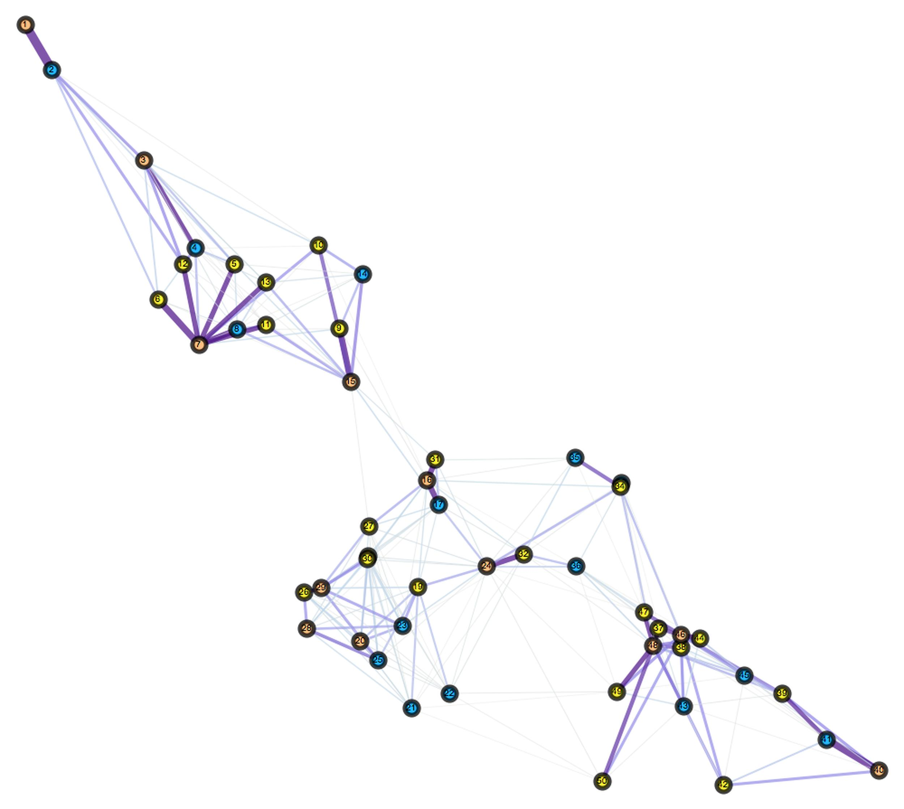

# Community Detection on Malarial Transmission Networks

<!-- ![alt text][ArtificialLandscapes/data/Maps/R030_P050_C003_D010_INet.jpg] -->



The goal of this project is to develop a geographically-constrained community detection algorithm for directed networks, and simulate its feasibility as a tool for increasing the mosquito mortality of targeted intervention methods.

## News

**(June 2018)** Preliminary results were presented at the 2018 Netsci: International School and Conference on Network Science. Our poster, titled *"Network Analysis of Mosquito Habitats for Controlling Vector-Borne Pathogens"*, can be found here:  https://www.netsci2018.com/posters

<!-- ## Background

Nearly half of the world's population is at risk of malaria. In 2015 alone, there was an estimated 212 million cases and 429,000 deaths caused by malaria, posing a major threat to human health and economic growth around the world. Increases in intervention and control measures have resulted in a 29% reduction in malaria mortality rates globally since 2010. Therefore, analyzing the efficacy and efficiency of intervention methods is a vital area of study for malaria elimination. One such area of study focuses on the targeted elimination of mosquitoes. These measures are effective because they aim to apply mosquito-specific pesticides in subsets of local populations most susceptible to infection. However, most, if not all, targeted intervention rely on detecting infection distribution relative to permanent human habitation. Yet, malarial infection is pervasive in transient and nomadic human populations around the world. Therefore, there is interest in targeted intervention aimed at the mosquito communities, in which intervention methods are deployed in vital locales of the mosquito habitat to increase mosquito mortality.

Mosquitoes do not move homogeneously over their habitat because they must move to fulfill certain biological needs. Therefore, mosquitos exhibit directional, heterogeneous movement across its habitat. However, most methods of community detection were developed for undirected networks. These community detection algorithms rely solely on the topography of the network (e.g. measures of node degree and localized edge density) and so, are blind to the community structure imparted by directional movement. On the other hand, community detection algorithms for directed networks, such as the map framework algorithms, consider directional movement, but not geographic range. Many malarial interventions have limited geographic range and logistical challenges associated with deploying intervention campaigns over large land areas. In the context of the targeted intervention of mosquitos, both topographical and map-framework clustering algorithms have major limitations. Therefore, assessing the feasibility of target intervention on mosquito communities requires the development of a geographically-constrained community detection algorithm for directed networks. -->

## Usage

This package is still in development. In particular, I working to define benchmarks for which to evaluate its effectiveness and to develop realistic pointsets representing mosquito movement and ecology.

Currently, it takes in a networkX .net file, a file of (X, Y) coordinates, and outputs a .csv mapping each site in the coordinate file to a cluster that minimizes the entropy of the system within some geographic limits. 

To use the script, run the command:

```
python clusteringScript.py --graph-filename <path_to_.net_graph> --coordinates <path_to_csv_of_landscape> 

```

Example: 

```
python clusteringScript.py --graph-filename houses.net --coordinates coordinates.csv 
```
 
 or 

```
python clusteringScript.py --g houses.net --c coordinates.csv 
```
 
Optimizing over all possible clusters is an combinatorial optimization problem. Because of the large search space, an exhaustive search is NP-hard. Therefore, I am using simulated annealing, a stochastic optimization algorithm, to select the clusters. The algorithm has been shown to [converge to the global optimum with high probability given a large enough number of trials](https://www.cambridge.org/core/journals/advances-in-applied-probability/article/convergence-and-finitetime-behavior-of-simulated-annealing/E71F662ACA634FE249EF6AD542B93739). Therefore, specifying a suitable number of steps for which to run the optimization is vital to ensure convergence.

Example: 

```
python clusteringScript.py --g houses.net -c coordinates.csv --steps 100
```


I plan to add additional functionality, such as 
## Affiliation

This project is part of an ongoing effort between [Marshall Lab](https://www.marshalllab.com) at UC Berkeley and the [Institute for Health Metrics and Evaluation(IHME)](http://www.healthdata.org) at UW Medicine to model and analyze the spatial dynamics of malarial transmission.

More information about these efforts can be found here: 

https://chipdelmal.github.io/MoNeT/

https://marshalllab.github.io/MGDrivE/

